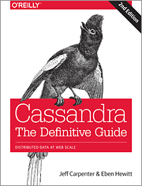

# cassandra-guide
This repository provides source code samples and notes for the O'Reilly book 
[Cassandra: The Definitive Guide, 2nd Edition](http://shop.oreilly.com/product/0636920043041.do).

Examples are available for the following chapters:

* Chapter 8 "Clients" - the [com.cassandraguide.clients](/cassandra-tdg/src/com/cassandraguide/clients) package contains 
examples of basic read, write and metadata operations available via the 
[DataStax Java Driver](https://github.com/datastax/java-driver)
* Chapter 9 "Reading and writing" - the [com.cassandraguide.readwrite](/cassandra-tdg/src/com/cassandraguide/readwrite) 
package contains more advanced examples including batches, transactions and deletes
* Chapter 12 "Performance Tuning" - the [com.cassandraguide.performance](/cassandra-tdg/src/com/cassandraguide/performance) 
package contains a query tracing example
* Chapter 14 "Deploying and Integrating" - the [com.cassandraguide.integration](/cassandra-tdg/src/com/cassandraguide/integration) 
package contains an example using the [DataStax Spark Cassandra Connector](https://github.com/datastax/spark-cassandra-connector)

Schema (CQL), cassandra-stress, and a sample .csv file for bulk import are available under [resources](/cassandra-tdg/resources).

These examples are not intended to represent a complete application, but are more of the bare minimum code required to 
access various Cassandra features . As such, the examples are useful for cut and paste into your applications according 
to the Apache license below. See the [Reservation Service](https://github.com/jeffreyscarpenter/reservation-service)
repository for a more well rounded example.

Comments, improvements and feedback are welcome.

Copyright 2016 Jeff Carpenter

Licensed under the Apache License, Version 2.0 (the "License");
you may not use this file except in compliance with the License.
You may obtain a copy of the License at

http://www.apache.org/licenses/LICENSE-2.0

Unless required by applicable law or agreed to in writing, software
distributed under the License is distributed on an "AS IS" BASIS,
WITHOUT WARRANTIES OR CONDITIONS OF ANY KIND, either express or implied.
See the License for the specific language governing permissions and
limitations under the License.
